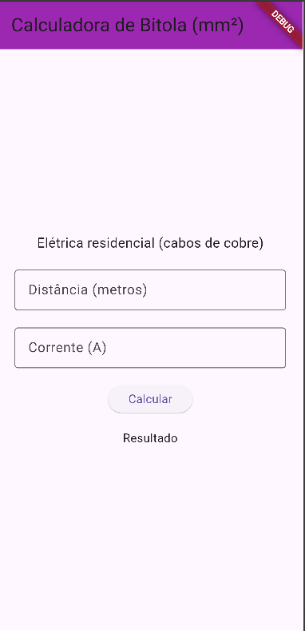
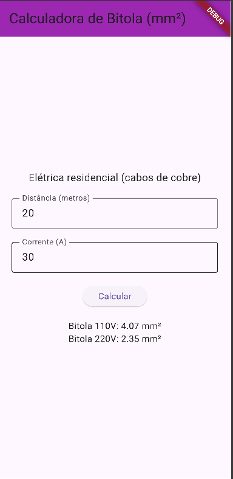

# Calculadora de Bitola

Projeto basico aprendendo flutter, calculadora de bitola de cabos elétricos.

#Prints



## Tecnologias
- Flutter
- VsCode
- Android Studio

# Passo a passo
- Clone este repositorio
- Abra com VsCode
- Em um terminal digite
```bash
flutter pub get
flutter run
```
